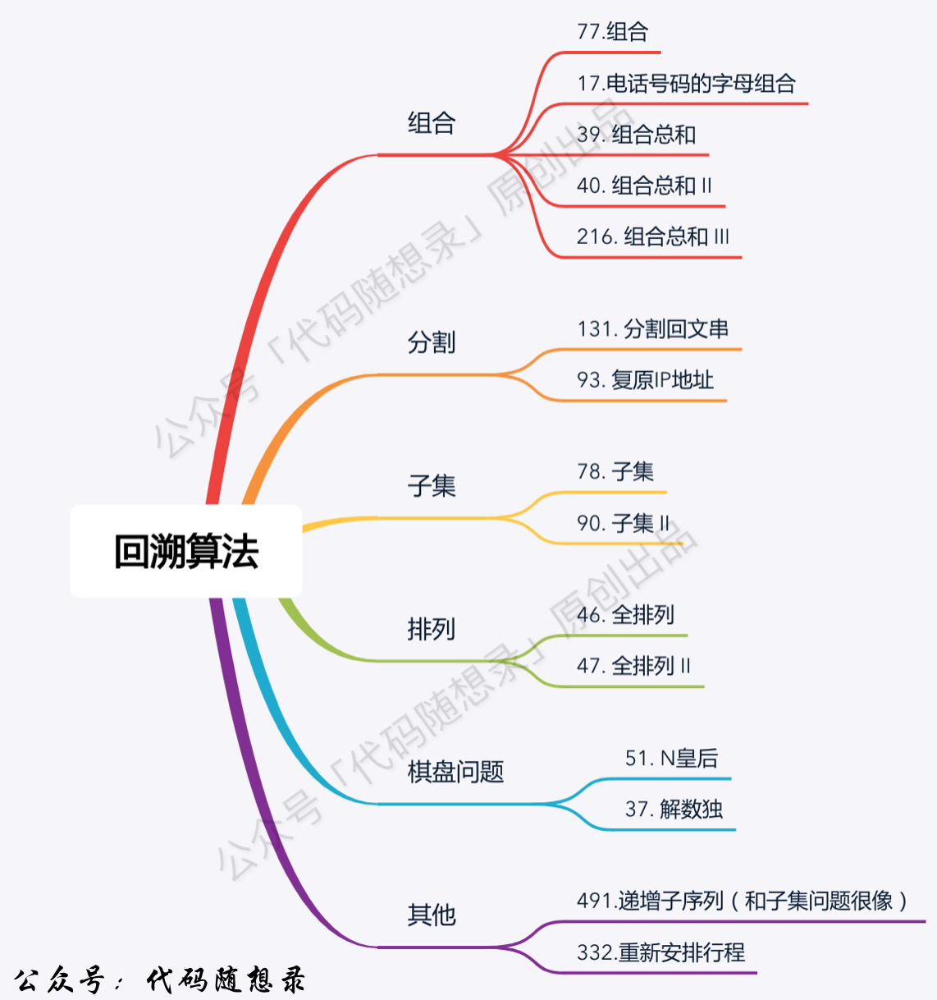

## 回溯
### 1 回溯解决的问题

+ 组合问题：N个数按一定规则找出k个数的集合
+ 切割问题：一个字符串按一定规则有几种切割方式
+ 子集问题：N个数的集合里有多少符合条件的子集
+ 排列问题：N个数按一定规则全排列，有几种排列方式
+ 棋盘问题：N皇后，解数独等
### 2 对回溯的理解
回溯法解决的问题都可以抽象为一种**树形结构**
，都是在集合中递归查找子集，集合的大小构成**树的宽度**，递归的深度构成**树的深度**
### 3 回溯法模板
+ 确定回溯函数返回值及参数--通常是先写逻辑，需要参数的时候再加
+ 确定终止条件--通常是到达叶子节点
+ 确定遍历的过程

伪代码如下：
```c++
for(选择：本层集合中的元素){
    处理节点；
    backtrack(路径，选择列表);//递归
    回溯，撤销处理结果
}
```


